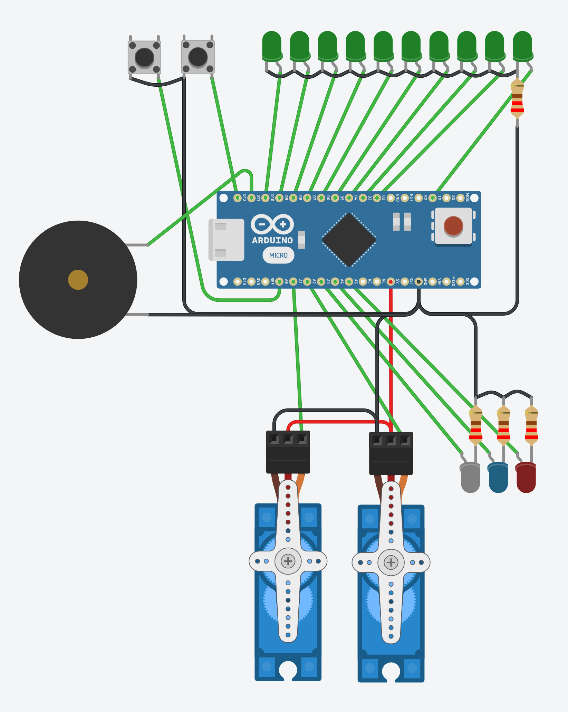

# ghost-trap-toy
trying to make a simple Ghost Trap toy with Arduino Nano

## Circuit



## How to build PlatformIO based project

1. Install [PlatformIO Core](https://docs.platformio.org/en/latest//core/installation.html).
2. Run these commands:

```sh
# Build project
> platformio run

# Upload firmware
> platformio run --target upload

# Clean build files
> platformio run --target clean
```
